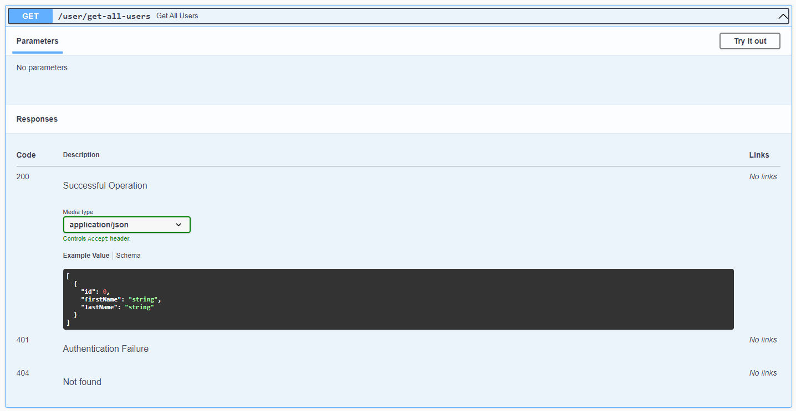

# Spring-Boot-Swagger-Docs
It is a sample spring boot application to demonstrate the generation and implementation of API documentation via Swagger

### Prerequisites for running the application:

---
Please make sure to have an active instance of MySQL DB running on your system before starting the application.

In case, if you don't have MySQL installed on your system then you could also simply run a container from the mysql image (taken from DockerHub) using the following command:

```docker run --name mysqldb -p 3306:3306 -e MYSQL_ROOT_PASSWORD=password -d mysql```

Once the container is in running state (which you could verify either using docker desktop app or using the command ```docker ps```), you can make use of MySQL Workbench to validate the connection with your running container on port **3306**.

The password specified for mysql DB **root** acoount is **password** :)

---
Once we are done with validating the connection, we need to create the target database as pracDB (the name of the database which I am using in my application).

We can do it either by using MySQL Workbench or by executing the following command in console

```docker exec -it mysqldb mysql -u root -p```

This command prompts for the root password which we specified at the time of running the container. After entering the correct credentials, we get the access to the mysql client where we can execute the SQL query as ```create database pracDB```

We could also create the database with some other name but make sure to change the **spring.datasource.url** property accordingly in application.yaml file.

---
In this method, we have explicitly defined a datasource and a corresponding JdbcTemplate object to perform the setup by referring to the properties defined in the application.yaml file.

The configuration are done within the file J**DBCConfig.java**

---

Before running the application, please locate the **USER.sql** file present in the root directory and execute the command either on your mysql client ar directly onto the MySQL workbench (the steps for accessing which are already present above)

---
### Overview of API Documentation

API documentation serves as a comprehensive reference for developers who want to integrate their own software with an existing application or service. It provides all the necessary details and instructions for using the API effectively, including:

* Endpoint Information
* Request and Response Formats
* Authentication and Authorization
* Examples and Code Snippets
* Data Models
* Versioning and so on

There are many tools we can use to document the RESTful APIs. Some of them include - Swagger, OpenAPI, etc.

<aside>
💡 Springfox is only compatible with spring boot till version 2.6.x.
</aside>

<aside>
💡 Spring boot version 3.x is not compatible with Springfox as spring boot 3.x make use of jakarta instead of javax whlie Springfox has certain mixed dependencies internally with javax.
</aside>

With Spring boot 3x, we can make use of openAPI v3 provided by spring-doc for which we can add the following dependency:
```
<dependency>
    <groupId>org.springdoc</groupId>
    <artifactId>springdoc-openapi-starter-webmvc-ui</artifactId>
    <version>2.2.0</version>
</dependency>
```

Post that, we need to create a bean of OpenAPI in the SwaggerConfig class as follows:
```
@Bean
public OpenAPI springShopOpenAPI() {
    return new OpenAPI()
            .info(new Info().title("Spring Boot Sample API Application")
                    .description("Spring boot sample application")
                    .version("v0.0.1")
                    .license(new License().name("Apache 2.0").url("http://springdoc.org")))
            .externalDocs(new ExternalDocumentation()
                    .description("GitHub Profile")
                    .url("https://github.com/samyakagarwal20")
            );
}
```
<br>

After these configuration are done, we can visit the swagger ui by hitting ```http://localhost:8080/swagger-ui/index.html``` on the browser 


We can also use the below URI's as well:
* ```http://localhost:8080/v3/api-docs``` - to get the openAPI specification in JSON format
* ```http://localhost:8080/v3/api-docs.yaml``` - to download the openAPI specification in YAML format

### Custom operations in API documentation in Spring Boot 3.x
The following are some of the changes we can make to add some additional info to our API documentation in spring boot 3.x:
<br>

* Adding info regarding different response types and the schema they will be using 
  * We can add the following at the controller level to define the different response types
    ```
    @Operation(summary = "Get All Users", responses = {
        @ApiResponse(responseCode = "200", description = "Successful Operation", content = @Content(mediaType = "application/json", array = @ArraySchema(schema = @Schema(implementation = User.class)))),
        @ApiResponse(responseCode = "404", description = "Not found", content = @Content),
        @ApiResponse(responseCode = "401", description = "Authentication Failure", content = @Content(schema = @Schema(hidden = true))) })
    ```    

  * The following changes will appear on swagger-ui
  
    

  <br>
* We can add some description to the fields of class as follows
  * Add the ```@Schema``` annotation as below
    ```
    public class User {

        @Schema(description = "Id of user")
        Integer id;
    
        @Schema(description = "User's first name")
        String firstName;
    
        @Schema(description = "User's last name")
        String lastName;

    }
    ```    

  * The following changes will appear on swagger-ui
  
    
  
  <br>
* We can also add some validations to the fields of the class as follows
  * Add the various validations supported by spring-validation api
    ```
    public class PostUserRequest {

        @NotBlank(message = "User firstName is a required field and cannot be blank")
        @Size(min = 3, max = 20, message = "firstname can have min 3 and max 20 characters")
        @Schema(description = "firstname can have min 3 and max 20 characters")
        String firstName;
    
        @NotBlank(message = "User lastName is a required field and cannot be blank")
        @Size(min = 3, max = 50, message = "lastname can have min 3 and max 50 characters")
        @Schema(description = "lastname can have min 3 and max 50 characters")
        String lastName;
    
    }
    ```    

  * The following changes will appear on swagger-ui
  
  
